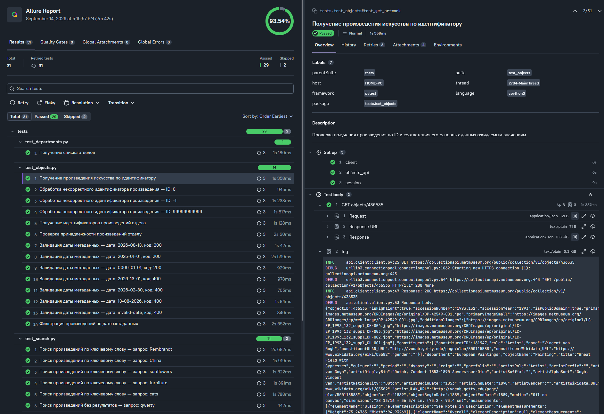

# 🏛️ Met Museum API Tests

Автоматизированное тестирование **The Metropolitan Museum of Art Collection API** с использованием Python.

---

## Покрытие API

| API | Проверяемые сценарии |
|---|---|
| **Objects API** | Получение произведения по ID, обработка некорректного ID, получение объектов отдела, проверка принадлежности к отделу, валидация даты метаданных, фильтрация по дате |
| **Search API** | Поиск по ключевому слову, отсутствие результатов, `limit`, `offset`, `hasImages`, `isHighlight`, фильтрация по отделу, диапазон дат, порядок query-параметров, превышение `limit` |
| **Departments API** | Получение списка отделов, проверка уникальности ID и наличия названий |

---

## Найденные проблемы API

В ходе тестирования были обнаружены две проблемы:

- `hasImages=true` — API может возвращать произведения без изображений;
- `isHighlight=true` — API может возвращать произведения с `isHighlight=false`.

Оба случая зафиксированы отдельными тестами и отмечены как `xfail`, поскольку проблема находится на стороне API.

---

## Allure Report

Пример отчёта:



---

## Структура проекта

```text
metmuseum-api-tests/
│
├── api/
│   ├── client.py          # Общий HTTP-клиент
│   ├── departments.py     # Departments API
│   ├── objects.py         # Objects API
│   └── search.py          # Search API
│
├── models/
│   ├── artwork.py         # Модель произведения
│   ├── department.py      # Модели отделов
│   ├── object_list.py     # Модель списка объектов
│   └── __init__.py
│
├── tests/
│   ├── test_departments.py # Тесты Departments API
│   ├── test_objects.py     # Тесты Objects API
│   └── test_search.py      # Тесты Search API
│
├── utils/
│   ├── allure_helpers.py  # Вспомогательные функции Allure
│   └── test_metadata.py   # Названия и описания тестов
│
├── conftest.py            # Фикстуры и настройки Pytest
├── pytest.ini             # Конфигурация Pytest
├── requirements.txt       # Зависимости проекта
└── README.md
```

---

## Технологии

- **Python 3**
- **Pytest** — написание и запуск тестов
- **Requests** — HTTP-запросы
- **Pydantic** — валидация ответов API
- **Allure Report** — отчётность
- **Logging** — техническое логирование
- **Git** — контроль версий

---

## Используемый API

В проекте используется официальный **The Metropolitan Museum of Art Collection API**.

Основные endpoints:

```text
GET /public/collection/v1/objects
GET /public/collection/v1/objects/{objectID}
GET /public/collection/v1/departments
GET /public/collection/v1.1/search
```

Документация API:

https://metmuseum.github.io/

---

## Установка

Клонировать репозиторий:

```bash
git clone https://github.com/n1kL1111/metmuseum-api-tests.git
cd metmuseum-api-tests
```

Создать виртуальное окружение:

```bash
python -m venv .venv
```

Активировать его:

```powershell
.venv\Scripts\Activate.ps1
```

Установить зависимости:

```bash
pip install -r requirements.txt
```

---

## Запуск тестов

Запустить все тесты:

```bash
pytest
```

Запустить отдельный файл:

```bash
pytest tests/test_search.py
```

Запустить конкретный тест:

```bash
pytest tests/test_search.py::test_search_limit
```

---

## Allure Report

Для формирования результатов Allure:

```bash
pytest --alluredir=allure-results
```

После выполнения тестов запустить отчёт:

```bash
allure serve allure-results
```

---

## Логирование

Для технического анализа используется стандартный модуль Python `logging`.

В лог записываются:

- HTTP-метод;
- URL запроса;
- query-параметры;
- статус ответа;
- фактический URL;
- ошибки выполнения запроса.

Лог сохраняется в корне проекта:

```text
test.log
```

Основная информация также выводится в консоль при запуске Pytest.